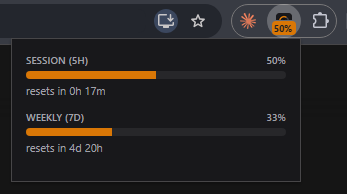

# Usage HUD for Claude

See your Claude usage limits at a glance, from any tab.

Claude has a rolling 5-hour session limit and a weekly limit, and the only place to check them is Settings > Usage on claude.ai. This extension keeps both one glance away, so a limit doesn't catch you by surprise in the middle of a task.

## What it does

- **Toolbar badge** shows your current 5-hour session usage. Amber normally, red at 90% or more.
- **Popup** (click the icon) shows both the session and weekly limits, with a countdown to each reset.
- Works from any tab, with no need to keep claude.ai open.
- Refreshes every minute, and again whenever you open the popup.

## Install

The extension isn't on the Chrome Web Store yet, so for now you load it manually. It takes about a minute.

1. Click the green **Code** button on this page, choose **Download ZIP**, and unzip it.
2. Open `chrome://extensions` in Chrome.
3. Turn on **Developer mode** (top-right corner).
4. Click **Load unpacked** and select the unzipped folder (the one containing `manifest.json`).
5. Click the puzzle-piece icon in the toolbar and pin **Usage HUD for Claude**.
6. Make sure you're logged in at [claude.ai](https://claude.ai).

To update later, download the new version, replace the folder, and click the reload icon on the extension's card in `chrome://extensions`.

## Badge states

| Badge | Meaning |
|---|---|
| Amber, e.g. `48%` | Your current 5-hour session usage |
| Red, e.g. `92%` | 90% or more of your session limit used |
| Grey `!` | Usage couldn't be loaded (usually because you're not logged in at claude.ai) |

## Permissions

| Permission | Why it's needed |
|---|---|
| `storage` | Caches the latest usage numbers so the popup opens instantly |
| `alarms` | Refreshes usage once a minute |
| `https://claude.ai/*` | Reads your usage from claude.ai using your existing login |

There's no content script and no access to any other website.

## Privacy

The extension only talks to claude.ai. It stores just the latest usage figures, their reset times, and when they were last fetched, in Chrome's local storage on your device. No analytics, no tracking, no third-party servers. See [PRIVACY.md](PRIVACY.md).

## How it works

- `background.js` is a service worker that fetches usage every minute (via `chrome.alarms`), caches it in `chrome.storage.local`, and updates the badge.
- `usage.js` has the shared helpers: it finds your organization, fetches its usage, and formats the reset countdown. Accounts can have more than one organization, so it checks each chat-capable one and uses the first that returns usage data.
- `popup.html` / `popup.js` render the popup from the cache and ask the service worker for a fresh refresh when opened.

## Limitations

This extension relies on an undocumented internal claude.ai endpoint. It can change at any time without notice, which would break the extension until it's updated. If you see a grey `!` while you're logged in, that's the likely cause, so please open an issue.

## Disclaimer

This is an independent side project. It is not affiliated with, endorsed by, or supported by Anthropic. "Claude" is used only to name the product this extension works with.

## License

[MIT](LICENSE)
